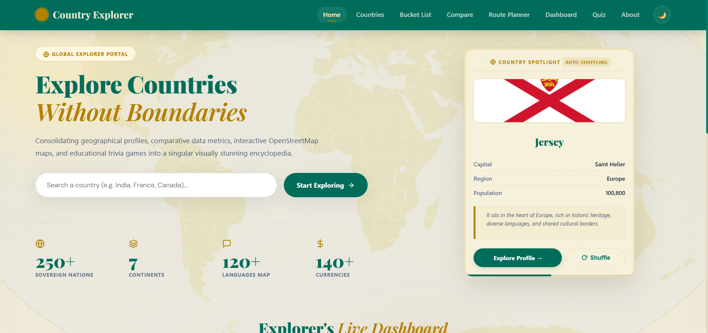
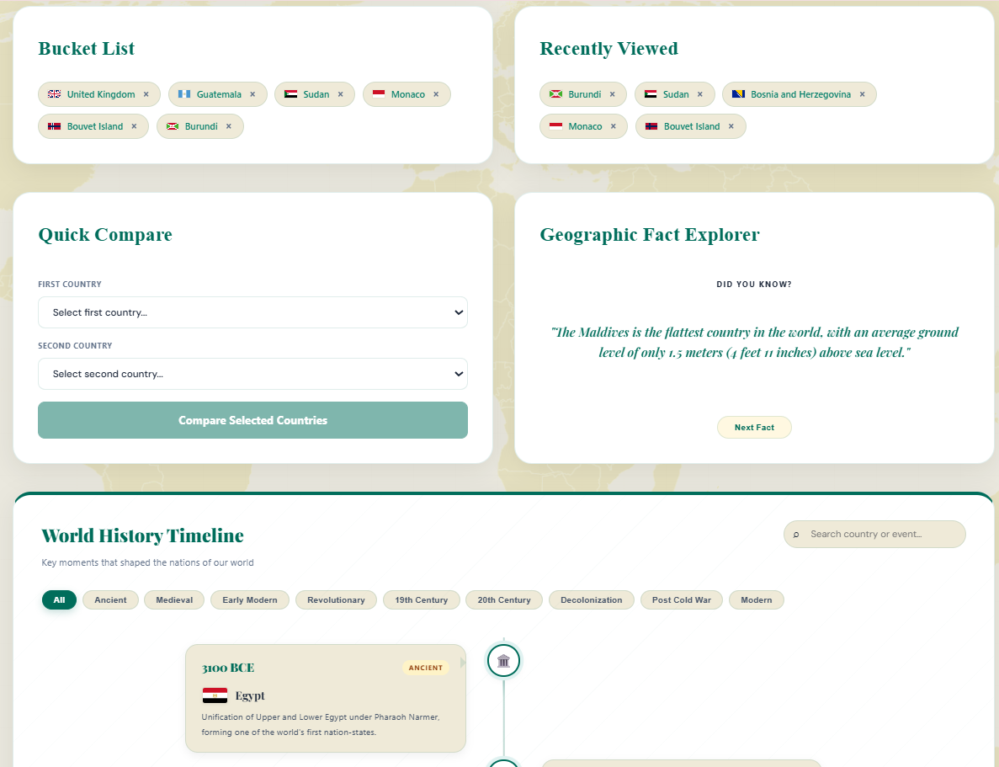
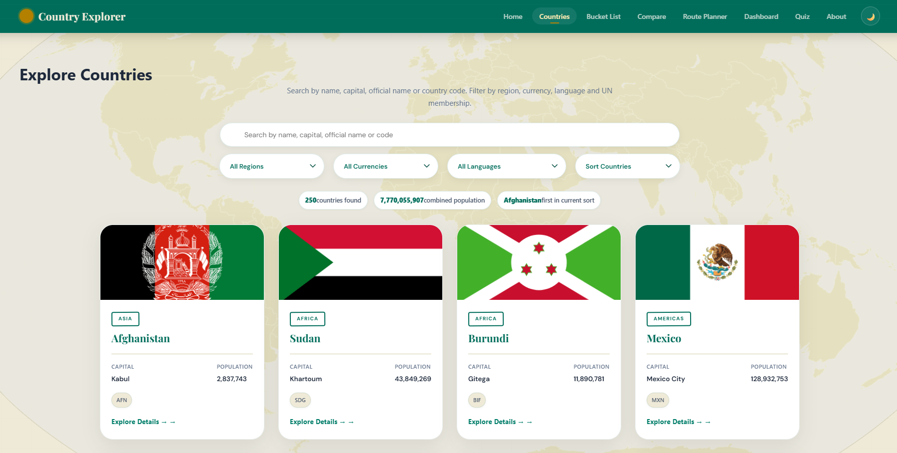
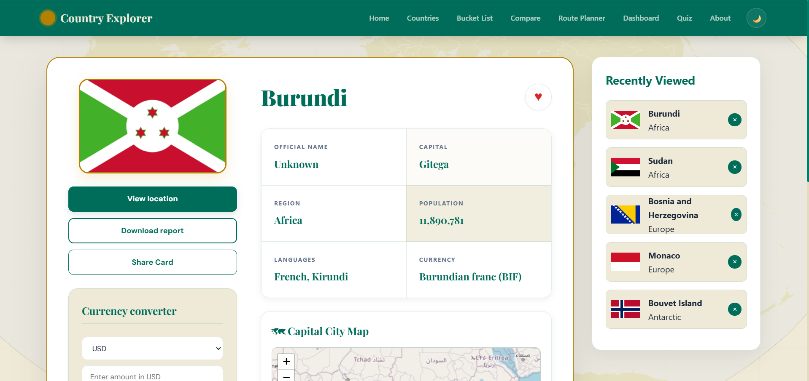
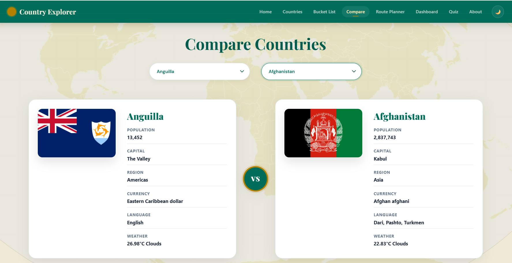
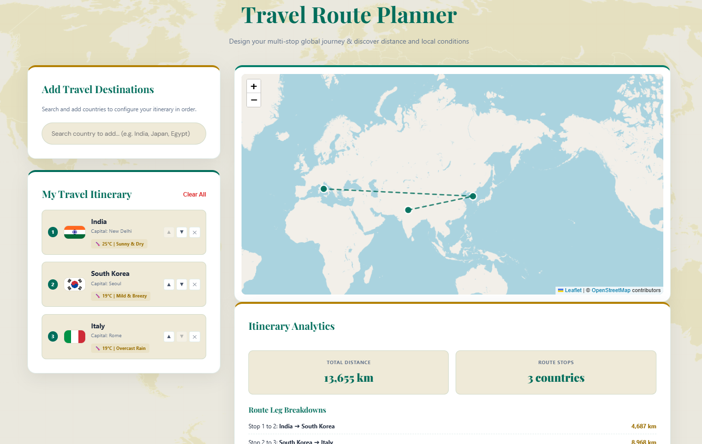
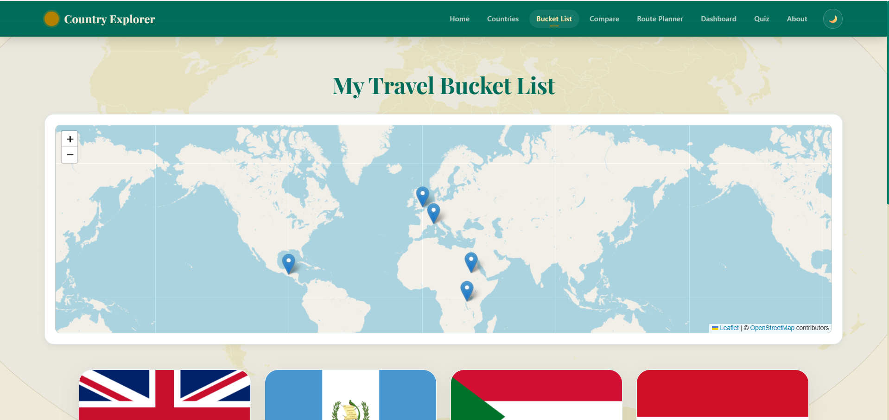
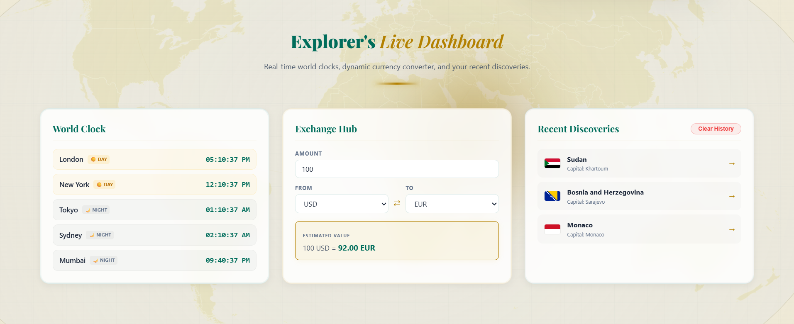
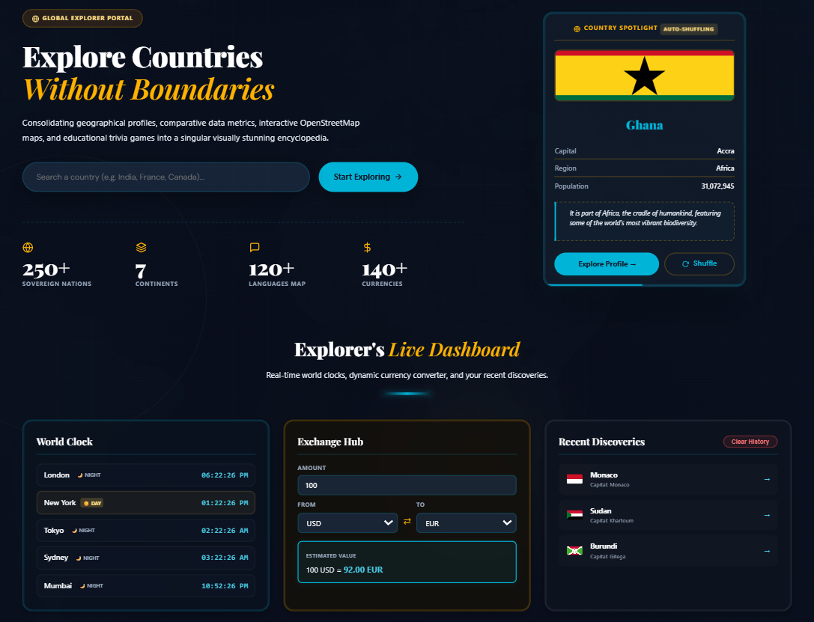

# 🌍 GeoSphere Analytics

GeoSphere Analytics is a modern React-based world intelligence and geographical analytics platform that allows users to explore countries around the world through interactive dashboards, maps, comparison tools, travel planning, quizzes, currency insights, and global statistics.

The platform combines country information, live APIs, data visualization, interactive maps, and analytics to provide an engaging experience for learning and exploring global geography.

---

# 📸 Project Preview

## Home Page


## Explorer Dashboard Features


## Country Search & Filtering


## Country Details


## Analytics Dashboard


## Country Comparison


## Travel Route Planner


## Bucket List Map


## World Statistics Dashboard


## Geography Quiz


## Currency Converter


## Dark Mode

```


---

# ✨ Features

## 🌎 Global Country Explorer

- Explore 250+ countries worldwide
- Search countries instantly
- Filter countries by:
  - Name
  - Capital
  - Region
  - Currency
  - Language

View complete country information:

- National flag
- Capital city
- Population
- Region
- Sub-region
- Languages
- Currency details
- Location information


---

# 📊 World Intelligence Dashboard

Interactive analytics dashboard with visual insights:

- Total countries analysis
- Regional statistics
- Population insights
- Language distribution
- Currency analytics
- Top populated countries
- Graph-based visualization


---

# 🔍 Country Comparison

Compare two countries side-by-side.

Comparison includes:

- Country flags
- Population
- Capital cities
- Continents
- Languages
- Currency
- Weather information

Provides a simple and clear comparison experience.


---

# 🗺️ Interactive Map System

Map-based exploration using OpenStreetMap.

Features:

- Country location display
- Travel bucket list visualization
- Route mapping
- Interactive map markers


---

# ✈️ Travel Route Planner

Plan international travel routes.

Features:

- Add multiple destinations
- Generate travel paths
- View route connections
- Track travel stops
- Interactive map visualization


---

# ⭐ Travel Bucket List

Personal travel tracking system.

Users can:

- Save favorite countries
- Create travel wishlist
- View saved countries on map
- Remove destinations
- Manage visited places


---

# 🧠 Geography Quiz

Interactive learning section.

Includes:

- Country questions
- Flag identification
- Capital quiz
- Population questions
- Timed challenges
- Random quiz generation


---

# 📈 World Statistics Dashboard

Explore global records and statistics.

Includes:

- Top spoken languages
- Top currencies
- Largest population records
- Largest land areas
- Country spotlight cards


---

# 💱 Currency Converter

Currency conversion feature.

Allows users to:

- Select currencies
- Enter amount
- Convert values
- Compare global currencies


---

# 🌙 Theme Switching

Modern dark mode support.

Features:

- Light mode
- Dark mode
- Improved accessibility
- Better user experience


---

# 🛠️ Technologies Used


## Frontend

- React.js
- JavaScript
- HTML5
- CSS3


## Libraries

- React Router DOM
- Axios
- Recharts
- Leaflet
- React Leaflet


## APIs Used

- REST Countries API
- OpenWeatherMap API
- Currency API
- OpenStreetMap


---

# 📂 Project Structure


```text
GeoSphere-Analytics

├── public
│
├── screenshots
│   ├── 01-home-page.png
│   ├── 02-home-dashboard-features.png
│   ├── 03-country-search.png
│   ├── 04-country-details.png
│   ├── 05-dashboard-analytics.png
│   ├── 06-country-comparison.png
│   ├── 07-travel-route-planner.png
│   ├── 08-bucket-list-map.png
│   ├── 09-geography-quiz.png
│   ├── 10-currency-converter.png
│   ├── 11-world-statistics-dashboard.png
│   └── 12-dark-mode.png
│
├── src
│   │
│   ├── assets
│   │
│   ├── components
│   │   ├── CountryCard.js
│   │   ├── Footer.js
│   │   ├── Header.js
│   │   ├── Loader.js
│   │   └── RecentlyViewed.js
│   │
│   ├── pages
│   │   ├── About.js
│   │   ├── BucketList.js
│   │   ├── Compare.js
│   │   ├── Countries.js
│   │   ├── CountryDetails.js
│   │   ├── Dashboard.js
│   │   ├── Home.js
│   │   ├── Quiz.js
│   │   └── RoutePlanner.js
│   │
│   ├── App.js
│   ├── index.js
│   └── App.css
│
├── .gitignore
├── package.json
├── package-lock.json
└── README.md
```

---

# ⚙️ Installation & Setup


Clone the repository:

```bash
git clone https://github.com/Manisha5918/GeoSphere-Analytics.git
```


Move into project folder:

```bash
cd GeoSphere-Analytics
```


Install dependencies:

```bash
npm install
```


Create environment file:

```text
.env
```


Add API key:

```env
REACT_APP_WEATHER_API_KEY=your_weather_api_key
```


Start application:

```bash
npm start
```


Application runs on:

```text
http://localhost:3000
```


---

# 🔐 Environment Security

API keys are stored safely using environment variables.

The `.env` file is added inside `.gitignore` and is never uploaded publicly to GitHub.


---

# 🚀 Future Enhancements

- AI-based travel recommendations
- User authentication
- Personalized travel profiles
- Advanced world analytics
- Offline geography encyclopedia
- Multi-language support


---

# 👩‍💻 Developer

**Manisha G**


---

# ⭐ Support

If you find this project useful, consider giving the repository a star ⭐
